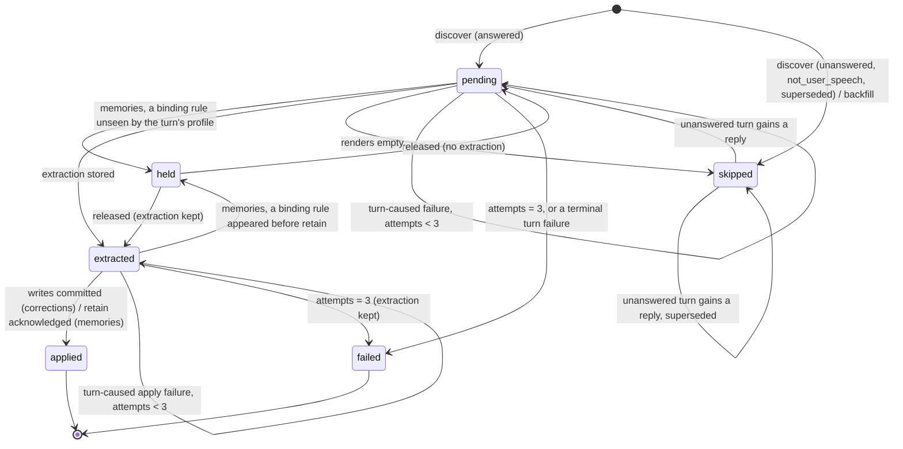

# Observation by Turn `[proposed]`

The Observer ([evolution.md](evolution.md#observer-and-consolidation-confirmed), [memory.md](memory.md#observer-pattern-post-conversation-extraction-confirmed)) extracts corrections and memories from a conversation's **turns**, one turn at a time and in order. Each turn and phase has a state row. Every write is keyed on the turn's durable identity, and nothing the model produces is used as a key. The idle trigger stays as the debounce. Each fire works through the turns not yet observed, up to a cap, and asks for a follow-up fire while a backlog remains.

This is a document of its own because it specifies a data model, a state machine and a failure contract that both extraction phases share ([state-machines.md](../.claude/rules/state-machines.md)). evolution.md and memory.md keep the extraction semantics (what a correction is, what a fact is, the rules each obeys) and link here for how the Observer moves through a conversation.

Industry practice it follows:

- **Mem0** extracts from each new user/assistant exchange, given a running summary and the last ~10 messages.
- **Zep/Graphiti** ingests one episode at a time, keyed by episode id.
- **LangMem** debounces before extracting.

## The Unit `[proposed]`

### Definition

A **turn** is the set of `messages` rows in one conversation that share a `last_inbound_message_id`, the **turn cursor**. Both writers stamp every row they write for a turn with that cursor:

- **Chat turns.** `handle-message`'s `create-user-message` and `persist-new-messages` use the batch's last inbound.
- **Pipeline stage turns.** `run-agentic-stage`'s `persist-stage-prompt` and `persist-new-messages` use the stage's prompt inbound.

No other code inserts messages.

**Identity.** A turn's durable id is `(conversation_id, turn_cursor)`. Inbound ids are UUIDv7 and unique across conversations, so the cursor alone also names the turn. That is what external keys (Hindsight document ids) use. The cursor is not a foreign key: `inbound_messages` rows are its source, but `messages` never referenced them.

**Parts of a turn.** All of them share the cursor:

| Part | Rows | How it is told apart |
|-|-|-|
| Turn row | The newest user row that `isTurnRowContent` accepts (no `tool_result` block, no `HARNESS_ROW_TAGS` block), as `findUserMessageByInbound` finds it | Content predicate |
| Earlier duplicate turn rows | Older user rows the same predicate accepts, left when `create-user-message` re-ran after its commit | Same predicate, not the newest |
| Tool rounds | Assistant rows with `tool_use` blocks, and user rows with `tool_result` blocks | Block type |
| Harness rows | The continuation prompt (user `text`, `harness: "continuation"`) and the volume nudge (`tool_result`, `harness: "volume_nudge"`) | Harness tag |
| Reply | Assistant rows with text. The last one is the final reply, which may carry a `truncation_notice` block or be the degraded reply | Role and block type |

**Order.** Turns are ordered by the smallest row id in each group. Rows are UUIDv7, and a turn's turn row is written before its replies, so this is arrival order. Grouping is by cursor, not by adjacency, so a pipeline stage's rows interleaving with a chat turn's still form two turns.

**Kind.** Read once, at discovery, from `inbound_messages.source` for the cursor, and stored on the observation row:

- `user` gives a `chat` turn;
- `scheduled` gives a `scheduled` turn;
- `pipeline` gives a `pipeline` turn;
- a missing inbound row (fixtures, rows that predate inbound buffering) gives `chat`.

**Answered.** A turn is answered when at least one assistant row carries its cursor. `persist-new-messages` writes all of a turn's assistant rows in one transaction, so a turn becomes answered atomically. The only rows that can join an answered turn later are duplicate replies from a re-run of that transaction (edge case 3).

**Superseded.** A chat turn is superseded when a later chat turn's turn row has an id below its first assistant row: that later turn was batched while this one was unanswered, so `getUnbatchedInbound` re-batched this turn's inbounds into it, and the same user words sit in both turn rows. It happens when a failed chat turn's retry lands after the next chat turn started ([Late replies](#late-replies)).

**Profile.** Every row of a turn carries the turn's `profile_id` snapshot (design/transport/overview.md → Profile and Model Stamping). The Observer uses the **turn's** profile, not the conversation's current one, for:

- the extraction model (`extractionModel ?? model`);
- `seesUserRules` (`admitsFirstParty`);
- the `profile_class` tag.

A `/profile` switch mid-conversation therefore observes each turn under the profile it ran under.

**Channels.** Correction scoping reads the turn's `turn_contexts.context.channelTypes` (keyed to the turn row). It falls back to `getActiveChannelTypes` only for a turn row with no stored context.

### Disposition at discovery

| Group | Disposition |
|-|-|
| Answered `chat` turn, not superseded | Observed in both phases |
| Answered `scheduled` or `pipeline` turn | Memories observed. Corrections skipped as `not_user_speech`: its user row is a task prompt, not the user's words. The user's reaction to its reply arrives in the next chat turn, which carries this turn as context. |
| Answered, superseded | Skipped in both phases as `superseded`. Its words are observed in the turn that re-batched them. |
| Answered, last message older than `BACKFILL_MAX_AGE`, found only by the backfill | Skipped in both phases as `aged_out` ([Backlog and Backfill](#backlog-and-backfill-proposed)) |
| Unanswered, with a later turn in the conversation | Skipped in both phases as `unanswered`. Not terminal: discovery reopens it if assistant rows appear (a late retry). |
| Unanswered and last | Not discovered: in flight, or awaiting its retry. A later fire decides. |

An unanswered **chat** turn's words reach the next chat turn, which re-batches its inbounds ([attachments.md](transport/attachments.md)). That holds only for chat: a failed scheduled turn followed by a user message gives a mixed batch, which `handle-message` rejects (Side bugs). A pipeline stage that kept nothing wrote only a prompt the pipeline authored.

### Late replies

`conversationTurnConcurrency` counts executing steps, not runs (`src/inngest/concurrency.ts`), so a failed chat turn's retry can run after a younger turn started. `handle-message`'s staleness guard reads the last assistant row from a memoized step, so a retry doesn't see the younger turn, and its `persist-new-messages` writes a reply for inbounds the younger turn already re-batched. Without handling, one user sentence is observed in two turns, and a contradiction counted in both retires a learning rule ("any other turn retires").

Two parts:

- **Root fix, a prerequisite PR.** `persist-new-messages` refuses, inside its transaction, when a user row with a larger `last_inbound_message_id` exists in the conversation: a newer turn covers its cursor. The run ends `stale`.
- **Backstop here.** `superseded` skips a turn whose reply landed after a later chat turn's row, in both phases, for history and for any residual race. The re-batching turn observes the words once. Residual: facts in the superseded reply's tool output are not extracted, which matches the root fix's behaviour.

### Rendering a turn

- **Included:** the turn row, the tool rounds, and the replies.
- **Dropped:**
  - earlier duplicate turn rows;
  - harness prompts (`isHarnessPrompt`);
  - images and thinking blocks;
  - the turn context's rendered block. Recalled memories are reference data from Hindsight, so extracting them again would feed memories back into themselves.
- **Kept:** the truncation notice, which is part of the reply.
- **Tool calls** render as `[Tool: name(input)] → result`, as `formatTranscript` does today.
- **Forwarded text** stays inside its `<forwarded_message>` element.

### Edge cases

1. **Debounced batch.** Several inbounds give one turn row, and the cursor is the batch's last inbound.
2. **Duplicate turn row** (an insert re-run after its commit). The group still has one cursor and one turn, and the newest turn row is the one rendered.
3. **Duplicate reply rows** (`persist-new-messages` re-run after its commit). The turn renders them twice, but it is still one unit with one extraction. Apply collapses that extraction's items on the same target, so the turn reinforces or contradicts a rule at most once. If the duplicates land after the turn was extracted, the stored extraction stands.
4. **Degraded turn.** The degraded reply is the final assistant row, so the turn is answered and observed. Its kept tool rounds are part of it, and the dropped iteration was never persisted.
5. **Continuation prompt and volume nudge.** They belong to the turn and are not rendered. A continuation prompt never becomes a turn row: `isTurnRowContent` rejects it.
6. **Cooldown reply.** Writes no `messages` row, so it is no turn.
7. **Summaries.** `conversation_summaries` rows are context, never turns. A summary whose `through_message_id` falls inside a turn doesn't split it.
8. **Turn in flight at discovery.** If the turn row has committed but `persist-new-messages` hasn't, the turn is unanswered and last, so it is not discovered. Discovery is an anti-join, not a cursor, so the next fire finds it however late its transaction commits.
9. **Mixed profiles in one conversation.** Each turn is observed under its own profile. A fire may resolve several extraction models.
10. **Deletion.** No code deletes conversations or messages. `messages.conversation_id` has no `ON DELETE` action, and `turn_observations.conversation_id` follows it. A future delete path removes a conversation's observation rows with its messages.

## State Machine `[proposed]`

### Storage

The state lives in a table, `turn_observations`, with one row per turn and phase. Owned by `agent/store/schema.ts`.

Why not columns:

- **On `messages`:** that would put mutable processing state on append-only rows.
- **On `conversations`:** that is a cursor again, the unit without identity.
- **Two status columns on one row per turn:** that would couple the phases' lifecycles, and every future phase would need a migration of its own.

With one row per turn and phase, the phases advance independently (they fail independently), and a new phase is a new enum value.

| Column | Type | Notes |
|-|-|-|
| `id` | UUIDv7 PK | DB-generated. The step-id suffix and the provenance reference. |
| `conversation_id` | UUID NOT NULL | FK → `conversations.id`, no `ON DELETE` action, as on `messages` |
| `turn_cursor` | UUID NOT NULL | The turn's `last_inbound_message_id`. Not an FK. |
| `turn_kind` | pgEnum `turn_kind` NOT NULL | `chat`, `scheduled`, `pipeline` |
| `phase` | pgEnum `observation_phase` NOT NULL | `corrections`, `memories` |
| `status` | pgEnum `observation_status` NOT NULL | `pending`, `held`, `extracted`, `applied`, `failed`, `skipped` |
| `skip_reason` | pgEnum `observation_skip_reason`, nullable | Set exactly when `status = 'skipped'`: `unanswered`, `not_user_speech`, `superseded`, `empty`, `backfilled`, `aged_out` |
| `attempts` | integer NOT NULL | Turn-caused failed attempts. Written explicitly (0) at insert, with no default. |
| `extraction` | JSONB, nullable | `TurnExtractionSchema`, via `jsonbZod`. Required in `extracted`/`applied`, forbidden in `pending`/`skipped`, optional in `held`/`failed` (kept when the turn failed or was held after extraction). |
| `failure` | JSONB, nullable | `TurnFailureSchema` (the last turn-caused failure). Set when `attempts > 0`. |
| `updated_at` | TIMESTAMPTZ NOT NULL | Set by every transition |
| `created_at` | TIMESTAMPTZ NOT NULL | `now()` default |

Constraints and indexes:

- `UNIQUE (conversation_id, turn_cursor, phase)`.
- A partial index on `(conversation_id, phase)` `WHERE status IN ('pending', 'held', 'extracted') OR skip_reason = 'unanswered'`, which serves discovery and planning.
- CHECK `chk_turn_observations_state`:

  ```sql
  (status = 'skipped') = (skip_reason IS NOT NULL)
  AND (status NOT IN ('extracted', 'applied') OR extraction IS NOT NULL)
  AND (status NOT IN ('pending', 'skipped') OR extraction IS NULL)
  AND (attempts > 0) = (failure IS NOT NULL)
  AND (status <> 'held' OR phase = 'memories')
  AND (status <> 'failed' OR attempts > 0)
  AND (skip_reason <> 'not_user_speech' OR (phase = 'corrections' AND turn_kind <> 'chat'))
  AND (skip_reason <> 'superseded' OR turn_kind = 'chat')
  ```

`extraction` groups atomic state ([architecture rules](../.claude/rules/architecture-rules.md)): the items, the run that wrote them, what rendering dropped (truncation), and what the evidence check dropped are written together, once, and never rewritten or erased. Hindsight document ids are positioned on it.

### States and transitions



| From | To | By | Guard | Writes |
|-|-|-|-|-|
| — | `pending` / `skipped` | `discoverTurns` | `INSERT … ON CONFLICT (conversation_id, turn_cursor, phase) DO UPDATE SET updated_at = turn_observations.updated_at RETURNING (xmax = 0)`, the no-op-SET shape from [inngest.md](../.claude/rules/inngest.md) | Row, `attempts = 0` |
| `skipped` (`unanswered`) | `pending`, or `skipped` (`superseded`) | `discoverTurns` | `WHERE id = ANY($1) AND status = 'skipped' AND skip_reason = 'unanswered'`, for turns now answered | `skip_reason` |
| `pending` | `held` | `extractTurn` (memories) | `WHERE id = $1 AND status = 'pending'` | — |
| `extracted` | `held` | `retainTurnMemories` | `WHERE id = $1 AND status = 'extracted'` | — (extraction kept) |
| `held` | `pending` / `extracted` | `discoverTurns` | `WHERE id = ANY($1) AND status = 'held'`, for turns no binding unseen rule holds. Target is `extracted` when `extraction IS NOT NULL`. | — |
| `pending` | `extracted` | `extractTurn` | `WHERE id = $1 AND status = 'pending'` | `extraction` (carrying `runId`) |
| `pending` | `skipped` (`empty`) | `extractTurn` | `WHERE id = $1 AND status = 'pending'` | `skip_reason` |
| `pending`, `extracted` | same status | `recordTurnAttempt` | `WHERE id = $1 AND status = $from AND attempts = $seen` | `attempts + 1`, `failure` |
| `pending`, `extracted` | `failed` | `recordTurnAttempt` | Same guard. Taken when `attempts + 1 = MAX_ATTEMPTS` (3) or the failure is terminal for the turn. | `attempts + 1`, `failure`; extraction kept |
| `extracted` | `applied` | `applyTurnCorrections` / `retainTurnMemories` | `WHERE id = $1 AND status = 'extracted'`. For corrections, the first statement of the transaction that writes the rules. | — |

`$seen` comes from the memoized outcome of the step that failed, so a replayed attempt step matches nothing and records once.

**Illegal**, so no store method expresses them:

- any transition out of `applied`, out of `failed`, or out of `skipped` with a reason other than `unanswered`. Only a future operator command reopens a `failed` row: to `extracted` if it holds an extraction, else to `pending`, with `attempts` reset (Open Questions);
- `extracted → pending`, and any write that erases or rewrites `extraction`;
- `pending → applied` without an extraction;
- `held` in the corrections phase, which the CHECK rejects.

Every transition reports whether it moved: `{ kind: "moved" } | { kind: "notInState"; actual }`, as `DrizzleCodingStore.transitionTaskStatus` does. Re-entry guards live inside the steps, and the bare body branches only on memoized outcomes ([inngest.md](../.claude/rules/inngest.md) → Never gate the bare body on state your own steps mutate).

### One turn, one phase, one fire

The function is registered as `observer-v2`, triggered by `conversation/idle` and `observer/backlog`, with `concurrency: { limit: 1, key: "event.data.conversationId" }`. Like `conversationTurnConcurrency` (`src/inngest/concurrency.ts`), that limit counts executing steps, not runs, so two fires of one conversation (and a `/reflect`) can interleave between steps. Correctness rests on the guarded transitions, not on serialization. `singleton` is not used: its `skip` mode drops an idle trigger that arrives mid-run, which strands the turn behind it on a dormant conversation.

Step ids carry a version, `observe-v1-…`. A change to a step's outcome shape bumps it, so a run in flight across that deploy re-runs the step's body against the DB rather than parsing a memoized value it can't read.

| Step id | Body | Returns (memoized) |
|-|-|-|
| `discover-turns` | One transaction: list open turn groups (SQL), insert rows for undiscovered turns, reopen answered `unanswered` skips, release held turns no binding rule holds any more, check the daily budget, and read the plan for both phases | `ObservationPlan`: per phase, up to the cap of turn refs, plus `remaining` |
| `observe-v1-<phase>-extract-<observationId>` | Read the row. If it is `extracted` (by any run), return `stored`. If terminal or `held`, return that. Otherwise render the turn and its context, check `held`, call the model, check evidence, and write `pending → extracted` with this run's id. If that UPDATE doesn't move, return `taken`. | `ExtractOutcome` |
| `observe-v1-<phase>-apply-<observationId>` | Read the stored extraction from the row, not from step state. Corrections: one transaction moves `extracted → applied` and then writes the rules. Memories: re-check `held`, `retainBatch` with positional document ids, then `extracted → applied`. | `ApplyOutcome` |
| `observe-v1-<phase>-attempt-<observationId>` | Runs when extract or apply returned `turnFailure`. Records the attempt with `$seen` from that outcome. | `AttemptOutcome` |
| `request-follow-up` | Sends `observer/backlog` with event id `observer-follow-up:<runId>` and `chain + 1`, immediately or delayed ([Follow-ups](#follow-ups-proposed)) | — |

`observationId` is the DB-minted id from the memoized plan, and `runId` is Inngest's, stable across a run's invocations. Step ids never contain model output, a clock or a fresh uuid.

**Per phase, the body walks the planned turns in order and stops the phase at the first outcome that isn't a clean move:**

| Outcome | Then |
|-|-|
| `extracted`, `stored` | Apply |
| `applied`, `alreadyApplied`, `held`, `skipped`, `terminal` | Next turn |
| `taken` | Stop the phase: another live run is ahead on this turn |
| `turnFailure` | Attempt step, then stop the phase (whether `retryLater` or `failed`) |
| `paused` | Stop the phase; delayed follow-up |
| A step that throws (after the harness's retries) | Stop the phase as `paused` (`unavailable`); delayed follow-up |

Stopping at a `failed` turn bounds a misclassified account-wide error to one `failed` turn per phase per fire.

## Types and Boundaries `[proposed]`

Sealed unions, matched with ts-pattern `.exhaustive()`. `Result` at use-case boundaries. Branded value types and readonly data, as in [tooling.md](tooling.md#kotlin-developer-patterns).

```typescript
// Value types
type ConversationId = Brand<string, "ConversationId">;
type TurnCursor = Brand<string, "TurnCursor">;            // messages.last_inbound_message_id
type TurnObservationId = Brand<string, "TurnObservationId">;
type ObservationRunId = Brand<string, "ObservationRunId">; // Inngest runId; a fresh uuid per /reflect call
type ObservationPhase = "corrections" | "memories";        // pgEnum observation_phase
type TurnKind = "chat" | "scheduled" | "pipeline";         // pgEnum turn_kind
type SkipReason =
  | "unanswered" | "not_user_speech" | "superseded" | "empty" | "backfilled" | "aged_out";

interface TurnRef {
  readonly observationId: TurnObservationId;
  readonly conversationId: ConversationId;
  readonly cursor: TurnCursor;
  readonly kind: TurnKind;
  readonly phase: ObservationPhase;
}

// The state a row holds. Parsed from the row at the store boundary, so an
// incoherent row is a parse error, not a branch.
type TurnObservationState =
  | { readonly status: "pending"; readonly attempts: number }
  | { readonly status: "held"; readonly attempts: number; readonly extraction: TurnExtraction | null }
  | { readonly status: "extracted"; readonly attempts: number; readonly extraction: TurnExtraction }
  | { readonly status: "applied"; readonly extraction: TurnExtraction }
  | { readonly status: "failed"; readonly attempts: number; readonly failure: TurnFailure; readonly extraction: TurnExtraction | null }
  | { readonly status: "skipped"; readonly reason: SkipReason };

type TurnExtraction =
  | {
      readonly phase: "corrections";
      readonly runId: ObservationRunId;
      readonly items: ReadonlyArray<CorrectionItem>;  // rule labels already resolved to rule ids
      readonly dropped: { readonly noEvidence: number; readonly unknownRule: number };
      readonly truncation: Truncation | null;
    }
  | {
      readonly phase: "memories";
      readonly runId: ObservationRunId;
      readonly items: ReadonlyArray<MemoryItem>;      // position = document id suffix
      readonly dropped: { readonly noEvidence: number };
      readonly truncation: Truncation | null;
    };

// Failure taxonomy. `classifyObservationFailure(err)` maps every expected
// error to exactly one variant; anything else is a bug and throws.
//
// Caused by the turn: recorded on the row.
type TurnFailure =
  | { readonly kind: "context_overflow"; readonly message: string } // terminal: the turn can't fit (`budget`, a context-length 400)
  | { readonly kind: "refusal"; readonly message: string }          // terminal: RefusalError
  | { readonly kind: "output_cut_off"; readonly message: string }   // terminal: OutputCutOffError
  | { readonly kind: "parse"; readonly message: string }            // counted: chatTyped's repair exhausted
  | { readonly kind: "rejected"; readonly status: number; readonly message: string }; // counted: unclassified 4xx (provider or Hindsight)

// Not caused by the turn: stops the phase for this fire, records no attempt.
type PhasePause =
  | { readonly kind: "auth"; readonly message: string }            // 401, 403
  | { readonly kind: "billing"; readonly message: string }         // 402, a billing/quota 400
  | { readonly kind: "model_not_found"; readonly message: string } // 404
  | { readonly kind: "config"; readonly message: string }          // ProviderConfigError
  | { readonly kind: "unavailable"; readonly message: string }     // transient (network, 408/425/429/5xx, Hindsight, DB) out of retries
  | { readonly kind: "daily_budget" };

// Step outcomes: small, JSON-safe, the only things the bare body branches on
type ExtractOutcome =
  | { readonly kind: "extracted"; readonly items: number }
  | { readonly kind: "stored"; readonly by: ObservationRunId }  // already extracted, by this or a dead run: apply it
  | { readonly kind: "taken"; readonly by: ObservationRunId }   // this step's own pending → extracted UPDATE lost
  | { readonly kind: "held" }
  | { readonly kind: "skipped"; readonly reason: "empty" }
  | { readonly kind: "terminal"; readonly status: "applied" | "failed" | "skipped" }
  | { readonly kind: "turnFailure"; readonly failure: TurnFailure; readonly seen: number }
  | { readonly kind: "paused"; readonly pause: PhasePause };

type ApplyOutcome =
  | { readonly kind: "applied"; readonly counts: PhaseCounts }
  | { readonly kind: "alreadyApplied" }
  | { readonly kind: "held" }
  | { readonly kind: "turnFailure"; readonly failure: TurnFailure; readonly seen: number }
  | { readonly kind: "paused"; readonly pause: PhasePause };

type AttemptOutcome =
  | { readonly kind: "retryLater"; readonly attempts: number }
  | { readonly kind: "failed"; readonly attempts: number }
  | { readonly kind: "stale" };                                 // the row moved since `seen`

// The aggregate: one conversation's open turns and their observation rows.
// Pure; built from one read, never mutated; plans what a fire does.
class ConversationObservation {
  static from(
    groups: ReadonlyArray<TurnGroup>,
    rows: ReadonlyArray<TurnObservationRow>,
  ): Result<ConversationObservation, ObservationInvariantError>;
  /** Rows discovery must insert: answered turns without one, and skips. */
  undiscovered(): ReadonlyArray<NewTurnObservation>;
  /** `unanswered` skips whose turn now has a reply, each to `pending` or `superseded`. */
  reopenable(): ReadonlyArray<Reopen>;
  /** Held turns whose profile is not in `stillBinding`. */
  releasable(stillBinding: ReadonlySet<ProfileId>): ReadonlyArray<TurnObservationId>;
  /** Up to `limit` `pending`/`extracted` turns of `phase`, in turn order, and how many remain beyond. */
  plan(phase: ObservationPhase, limit: number): PhasePlan;
}

interface PhasePlan {
  readonly phase: ObservationPhase;
  readonly turns: ReadonlyArray<TurnRef>;
  readonly remaining: number;
}

// Use cases: one file each, (deps, args) => ResultAsync
function discoverTurns(deps: DiscoverDeps, args: { conversationId: ConversationId }):
  ResultAsync<ObservationPlan, ObservationError>;
function extractTurn(deps: ExtractDeps, args: { turn: TurnRef; runId: ObservationRunId }):
  ResultAsync<ExtractOutcome, ObservationError>;
function applyTurnCorrections(deps: ApplyCorrectionsDeps, args: { turn: TurnRef }):
  ResultAsync<ApplyOutcome, ObservationError>;
function retainTurnMemories(deps: RetainMemoriesDeps, args: { turn: TurnRef }):
  ResultAsync<ApplyOutcome, ObservationError>;
function recordTurnAttempt(deps: AttemptDeps, args: { turn: TurnRef; failure: TurnFailure; seen: number }):
  ResultAsync<AttemptOutcome, ObservationError>;

type ObservationError =
  | { readonly kind: "transient"; readonly pause: Extract<PhasePause, { kind: "unavailable" }> } // the step throws it, for the harness's retry
  | { readonly kind: "invariant"; readonly detail: string };                                     // a bug: thrown, never recorded
```

`TurnFailure` and `PhasePause` are values in `Ok` outcomes. Only `ObservationError` reaches the step wrapper, which throws it.

**Error classification.** `isRetriableProviderError` (`src/llm/fallback.ts`) says only whether to retry; it treats every non-transient 4xx alike. `classifyObservationFailure` adds what the Observer needs: whether the turn caused it. A context-length 400 and a billing 400 share a status, so it reads the provider's error type or message, and a 4xx it can't place is `rejected`: counted against the turn, not terminal at once. `ProviderConfigError` is resolved per turn (the turn's profile picks the model) and becomes a `config` pause, not a `NonRetriableError` for the whole fire.

**Aggregate invariants** (`ConversationObservation.from` rejects a read that breaks one, as an `invariant` error):

1. There is at most one row per turn and phase.
2. Every row read has its turn among the groups read. No code deletes messages.
3. `plan` returns `pending` and `extracted` turns in turn order, never a terminal, `held` or `skipped` one. A phase's turns run in that order, and the walk stops at the first outcome that isn't a clean move, so a later turn is never applied ahead of an earlier one that can still succeed.
4. `held` turns neither block a phase nor take a place in its plan. Otherwise a run of held third-party turns would fill every plan and starve the turns after them. Holding a fact from turn 5 doesn't change what turn 6 means, so order matters less for facts.

**Where a throw is allowed.** Only in the step wrapper: an `Err` of kind `transient` is thrown so the harness retries the step, and an `invariant` is thrown as a bug. The harness is `ObserverStepHarness`:

- **Inngest** retries the step. When it fails for good, its `StepError` reaches the body, which catches it around extract and apply only and stops the phase as `paused` (`unavailable`). That is the [inngest.md](../.claude/rules/inngest.md) carve-out: every expected non-transient failure is a returned value, so the catch target is exactly "transient, out of retries", the designed pause channel. An `invariant` lands there too; it is also logged at error and reported in `failedPhases`.
- **Sync** (`/reflect`, `src/agent/evolution/trigger-reflection.ts`) calls the body once with no retries and no memoization. A throw is caught at the same place and pauses the phase. Attempts never depend on the throw path: they come from `turnFailure` outcomes, which both harnesses return alike.

**Files** (`src/agent/evolution/observation/`), each a pure module or one use case:

- `turns.ts`: `classifyTurn`, `renderTurn`;
- `conversation-observation.ts`: the aggregate;
- `failure.ts`: `classifyObservationFailure`;
- `budget.ts`;
- `discover-turns.ts`;
- `extract-turn.ts`: dispatches on phase to `extract-corrections.ts` and `extract-memories.ts`, which become pure prompt-and-parse modules over one rendered turn;
- `apply-turn-corrections.ts`;
- `retain-turn-memories.ts`;
- `record-turn-attempt.ts`.

`observer.ts` keeps only Inngest wiring and the per-fire loop, with consolidation and the drain unchanged.

The store is `ObservationStore` / `DrizzleObservationStore` in `src/agent/store/`: stateless, `tx` first. Its reads are `listOpenTurnGroups`, `listTurnObservations`, `getTurnObservation`, `loadTurnInput` and `countTurnCallsSince`, plus one method per row of the transition table. `listOpenTurnGroups` groups in SQL (`GROUP BY last_inbound_message_id`, with min row id, first assistant id, whether a later turn exists, and the superseded test as an `exists` over later chat turn rows), restricted by `notExists` to cursors lacking a terminal row in some phase. A fire reads its open turns, not the transcript.

## Context `[proposed]`

Each extraction gets the turn and, before it, labelled context:

```
<earlier_conversation>   already observed; use only to resolve references
  <summary>…</summary>   newest conversation_summaries row whose through_message_id precedes the turn's first row
  <turn>…</turn>          previous turn(s), newest last
</earlier_conversation>
<turn>…</turn>            the turn being observed; extract only from here
```

**What the context holds.** The previous two answered turns, each rendered as:

- its user text;
- its final reply;
- its tool calls collapsed to `[Tool: name]`.

Corrections need this most: a correction in turn N reacts to turn N−1's reply.

**Budget.** It comes from `resolveLimits` / `computeBudget` for the extraction model. After the system prompt, the turn gets up to half, and the context up to a quarter.

**Allocation.** Context is filled in priority order, and every message is capped individually (head and tail kept, the cut marked `[… N characters truncated]`). The order is:

1. turn N−1's final reply;
2. turn N−1's user text;
3. the summary;
4. turn N−2.

A huge earlier message is cut to its share and never pushes out the exchange right before the turn.

**Truncating the turn.** A turn over its share is truncated in this order:

1. tool results;
2. tool inputs;
3. replies;
4. the user's text last (head and tail).

What was cut is recorded in `extraction.truncation` and counted in the audit row. The turn is still processed whole, and there is no intra-turn position to lose a tail past.

**Too small.** A model whose budget can't hold the system prompt plus a minimal turn fails the turn at once as `context_overflow`. One whose budget can't fit the context sends the turn without it, and the truncation records that.

**Context cannot double-count.** Every write is keyed on the turn being observed, and a turn is applied once (`extracted → applied`):

- **Re-extraction cannot repeat writes.** Re-extracting turn N — a retried step, a run in flight across a deploy, a concurrent `/reflect` — finds the stored extraction or loses the conditional UPDATE, so it never writes twice.
- **Context items are filtered by evidence.** Context can still be misread as new, with the model reporting a correction from turn N−1 while observing turn N. The evidence check below filters it.

**Evidence, not citations.** The unit is one turn, so there is nothing to number. Each item carries `evidence`, a short verbatim quote, checked after normalizing case, whitespace and quote marks (the `rule_set` quote check's normalization):

| Phase | The quote must appear in |
|-|-|
| Corrections | The turn's user text, typed or transcribed. Forwarded text and documents don't count. A correction is the user's own reaction. |
| Memories | Any rendered text of the turn, tool results included, since facts come from tool output too |

An item that fails is dropped and counted (`dropped.noEvidence`). The quote filters items. It is never a key, so a paraphrased quote costs one item and changes no identity. The eval reports the drop rate, and a high one is a prompt problem, not a correctness problem.

## Writes and Keys `[proposed]`

### Corrections

The apply transaction runs in this order:

1. `UPDATE turn_observations SET status = 'applied' … WHERE id = $1 AND status = 'extracted' RETURNING extraction`. No row back means the turn is already applied, so it writes nothing.
2. The stored items, collapsed to one action per target rule. A contradiction wins over a reinforcement of the same rule.
3. The writes, through `upsertCorrection` and `contradictLearningRule`, unchanged except for the contradiction marker.

Under REPEATABLE READ, a concurrent apply of the same row blocks on the row lock and then fails with `40001`. The transactor retries it against a snapshot where the row is `applied`, so it writes nothing. A reinforcement is applied exactly once per turn, because the rule writes and the transition commit together.

**The contradiction marker** is `steering_rules.contradicted_in_turn_id UUID REFERENCES turn_observations(id) ON DELETE SET NULL`. It replaces `contradicted_in_conversation_id`.

- The first contradiction of a rule still learning resets the rule and records the corrections row of its turn.
- A contradiction from any other turn, in this conversation or another, retires the rule.
- A contradiction from the recorded turn changes nothing. That is a backstop, since a turn applies once.

The same user words never count as two turns: a superseded turn is skipped ([Late replies](#late-replies)). A rule contradicted twice in one long chat now retires. Any other retirement clears the marker, as today.

### Memories

- **Document ids.** Each stored item retains under `observer:turn:<turn_cursor>:<position>`, where `position` is the item's index in the stored `extraction.items`.
- **Re-sends.** `retainBatch` is a replace on `document_id` (Hindsight `update_mode: "replace"`, the default), so a re-sent batch names the same documents with the same content.
- **Stable positions.** The extraction is stored before the retain and never rewritten or erased, including through `held` and `failed`, so positions never shift. A re-run never re-extracts an extracted turn.
- **Tags.** As today: `network:`, `compartment:` and `trust:` come per item, and `profile_class:` comes from the turn's profile.

**Held.** The memories phase checks `bindsUnseenUserRule` against the rules the turn's profile sees:

- **Inside the extract step, before any model call.** If one binds, the turn goes `pending → held`.
- **At retain.** If a binding rule appeared after extraction, the retain step moves `extracted → held`, keeping the extraction. Held rows leave the plan, so they never fill the cap.
- **On every fire.** `discover-turns` reads the memory rules once for the profiles of the held turns. Once nothing binds a turn (the rule is retired, or the p2 first-party-model mode lands), it releases the turn to `extracted` if it holds an extraction, else to `pending`, and the turn is planned like any other. A release is progress, so it can start a follow-up chain.

## Follow-ups `[proposed]`

**Progress.** A fire made progress when it moved at least one row into `extracted`, `applied`, `skipped` or `failed`, or released a held one.

**Event.** `request-follow-up` sends `observer/backlog { conversationId, chain }` with event id `observer-follow-up:<runId>`. One run sends at most one follow-up, however often its body replays, and every new run has a new id, so a fire that planned the same turns as the last one is never deduplicated away.

| Fire ends with | Follow-up |
|-|-|
| `remaining > 0` in a phase and progress | Immediate |
| A phase stopped on `retryLater`, `paused` or a thrown step | Delayed: `ts` = now + `FOLLOW_UP_DELAY` (30 min), computed inside the step. `daily_budget` delays to the budget window's end. |
| Neither | None. The next idle fire resumes. |

**Chain budget.** `conversation/idle` and `/reflect` start a chain at 0. A follow-up carries `chain + 1`, and none is sent at `MAX_FOLLOW_UP_CHAIN` (20, about 200 turns per phase). An idle fire starts a new chain, so an active conversation keeps draining.

**Daily budget.** `discover-turns` counts the user's turn model calls in the last 24 hours (`countTurnCallsSince`: rows of the user's conversations whose `extraction` or `failure` was written in the window). At `OBSERVER_TURN_CALLS_PER_DAY` (400), both phases pause as `daily_budget`.

**Dormant conversations.** Discovery runs only when a fire runs, and fires follow `conversation/idle` (after `response/ready`, `src/agent/idle-timer.ts`), a follow-up, or `/reflect`. A transient failure on a conversation's last fire is retried by the delayed follow-up, within the chain budget. Past that, and for the pending backlog of a conversation nobody returns to, the policy is: no sweep. The backlog waits for the conversation's next turn or a `/reflect`, and `BACKFILL_MAX_AGE` keeps old dormant history out of the backlog altogether.

## Failure Modes `[proposed]`

| # | Crash or retry point | Resulting state | Why it is safe, or the residual |
|-|-|-|-|
| 1 | Inside the extract step, before the model returns | `pending` | Nothing is written. The step retry calls the model again, which is the one billable re-run. |
| 2 | After the model, before the `extracted` UPDATE commits | `pending` | Same as 1 |
| 3 | After `extracted` commits, before Inngest records the step | `extracted` | The re-run reads the row, returns `stored`, and calls no model |
| 4 | Between extract and apply | `extracted` | The re-invocation replays extract from cache and runs apply, which reads the extraction from the row |
| 5 | Inside the corrections apply transaction | `extracted` (rolled back) | The rule writes and the transition roll back together. The retry applies once. |
| 6 | After the apply transaction commits, before Inngest records the step | `applied` | The re-run's guarded UPDATE matches no row, returns `alreadyApplied`, and writes nothing |
| 7 | Hindsight acknowledges the retain, then the step fails before `extracted → applied` | `extracted` | The retry re-sends the stored items under the same document ids, which Hindsight replaces, then transitions |
| 8 | Hindsight unreachable after the step's retries | `extracted`, no attempt | The phase pauses (`unavailable`), with a delayed follow-up. The retry re-sends from the stored extraction, with no model call. |
| 9 | A run dies with a row `extracted` (retain out of retries, a `/reflect` crash between extract and apply, an uncaught error) | `extracted` | The next fire's extract step returns `stored` and applies it. Apply is guarded and retains are idempotent, so the row doesn't wait for the run that wrote it. |
| 10 | Turn-caused failure (`parse`, `rejected`) | `pending`/`extracted`, `attempts + 1`; `failed` at 3 | The phase stops for this fire to keep order, with a delayed follow-up. A turn that always fails holds its phase for at most 3 fires, then is passed. |
| 11 | Terminal turn failure (`context_overflow`, `refusal`, `output_cut_off`) | `failed` at once, extraction kept if any | The phase stops for this fire, so at most one turn per phase per fire fails this way |
| 12 | Account or config failure (`auth`, `billing`, `model_not_found`, `config`) | Unchanged | No attempt. The phase pauses for this fire, so an expired key or removed model fails no turns. Delayed follow-ups retry within the chain budget, then the next idle resumes. |
| 13 | Function-level retry (an error outside a step) | Unchanged | Steps replay from cache, the DB is the authority, and every transition is guarded |
| 14 | A run in flight across a deploy that changes a step's outcome shape | Whatever the DB holds | The versioned step id is new, so its body re-runs against the DB: discovery is an idempotent upsert, extract returns `stored`/terminal for moved rows, apply is guarded. Residual: a `pending` turn whose model call was in flight is billed once more. |
| 15 | A run of the transcript-era `observer` in flight across the PR 2 deploy | The old run can't resume: its function id is no longer served | Its corrections may have committed while its audit row is lost or lands after the backfill read `evolution_events`, so the backfill leaves those turns `pending` and they reinforce once more. Residual: at most one fire per conversation in flight at the deploy, usually none. |
| 16 | Concurrent `/reflect` and an idle fire | Each row moves once | Both may call the model for the same `pending` turn. The first `extracted` UPDATE wins, and the loser gets `taken` and stops that phase. Writes happen once (5, 6), and retains are idempotent. Residual: one duplicate model call per phase. |
| 17 | A turn's persist transaction commits after discovery's snapshot | Not discovered this fire | No cursor runs past it. The next fire's anti-join finds it. |
| 18 | A failed chat turn's retry persists a reply after a newer chat turn re-batched its inbounds | Its row `skipped` (`superseded`) | Its words are observed once, in the newer turn. Removed at the source by the `handle-message` prerequisite. |
| 19 | Hindsight accepts an async retain, then fails processing it server-side | `applied` | As today: `async: true` acknowledges a queued batch. Residual, not new. |
| 20 | A rule merged or retired between extract and apply | `applied` | Apply resolves stored rule ids against live rows. A missing or retired target counts as `unknownRuleReinforcementsSkipped`, as today. |
| 21 | A memory rule set between extract and retain | `held` (third-party) or `applied` (first-party) | A third-party turn is held at retain with its extraction. A first-party turn's extraction was prompted without the rule. Residual: a rule set in that seconds-wide window binds from the next turn on. |

## Failure Classes Excluded `[proposed]`

| Failure class | Mechanism |
|-|-|
| The backlog never drains after a capped fire | A fire with `remaining > 0` that made progress sends `observer/backlog` as its last step, one per run ([Follow-ups](#follow-ups-proposed)) |
| A dead run's extraction stalls its phase | `taken` only when this step's own UPDATE lost. An `extracted` row is applied by whichever run reaches it (row 9). |
| An account-wide error burns the backlog to `failed` | Only turn-caused failures touch the row. Auth, billing, not-found, config and transient failures pause the phase without an attempt, and the walk stops at the first `failed` turn of a fire. |
| Keys chosen by the model | Keys are the turn cursor, the phase, the DB-minted observation id, an item's position in the stored extraction, and the run id. Rule labels are resolved to ids at extraction and stored. The model's `evidence` filters items and never keys anything. |
| The same user words counted in two turns | `superseded` (row 18) |
| Truncation losing a message's tail past the cursor | There is no intra-turn cursor. A turn is processed whole, and what rendering cut is recorded (`extraction.truncation`, `truncated` in the audit row). Residual: cut text isn't extracted, visibly. |
| A unit that always fails stalls its phase | `attempts` with `MAX_ATTEMPTS = 3`, then `failed`. A `failed` turn no longer blocks, and the audit row counts it. |
| Unbounded cost on long or old conversations | SQL grouping of open turns only, the per-fire cap, the chain budget, the daily budget, and `BACKFILL_MAX_AGE` |
| Partial phases hidden in `/learned` | Per-phase turn counts in the audit row, rendered in `/learned` and the web table |
| Context lost when one large message precedes the turn | A context budget with per-message caps, allocated to the immediately preceding exchange first |
| Invisible skip and pause reasons | `skip_reason` is a pgEnum on the row. `held` is a status. The audit row counts skips by reason and records the pause. |

## Audit and Read Surface `[proposed]`

`EvolutionEventPayloadSchema` gains `turns`, optional so older rows parse:

```typescript
interface PhaseTurnCounts {
  readonly applied: number;
  readonly held: number;
  readonly retried: number;       // attempts recorded, still retryable
  readonly failed: number;
  readonly skipped: Readonly<Partial<Record<SkipReason, number>>>;
  readonly taken: number;
  readonly truncated: number;
  readonly droppedNoEvidence: number;
  readonly paused: PhasePause["kind"] | null;
  readonly remaining: number;     // non-terminal turns beyond this fire's plan
}
interface TurnsPayload { readonly corrections: PhaseTurnCounts; readonly memories: PhaseTurnCounts }
```

`corrections` and `memories` keep their item counts. `failedPhases` keeps meaning a phase-level failure: consolidation, drain, a plan that couldn't be read, or an `invariant` error. `messageCount` is written only by a fire that ran the transcript-era memories phase. `triggered_by` gains `follow_up`.

- **Fires that write a row.** A fire writes a row when it made progress, paused a phase, or the drain moved rows. Otherwise it returns `skipped: "nothing_new"`, which replaces `too_short` and `MIN_MESSAGES_FOR_EXTRACTION`. A short conversation's turns are observed like any other's.
- **`/learned`.** The digest line adds `turns 3 (1 held, 2 left)`, and a pause (`paused: auth`). The detail view lists the per-reason counts.
- **`/reflect`.** Runs the same loop in-process with a fresh run id and `REFLECT_TURNS_PER_PHASE = 3` (at most 6 model calls before the reply), then sends `observer/backlog` when work remains and says how many turns are left. It answers "Nothing new since the Observer last ran." for `nothing_new`.

## Backlog and Backfill `[proposed]`

**Cap.** `TURNS_PER_PHASE_PER_FIRE = 10`. A fire plans at most 3 steps per turn per phase, about 60 steps with the fixed ones, and the bare body replays without model calls.

**Cost.** One model call per turn per phase, against one per fire today. Each call repeats the system prompt (instructions, the profile's rule list, channel types) and adds one turn plus capped context. For a 20-turn conversation with a ~2k-token system prompt and ~1.5k tokens per turn with context, that is ~70k input tokens per phase against ~32k for one transcript call: about 2–3× input, plus 20 small outputs instead of one. Prompt caching is upside, not baseline: rule labels change after applies, channel types vary per turn, and short prompts fall below providers' minimum cacheable length. The prompt puts the static instructions first and the rules and channel types after, so what can cache does.

**Backfill.** Existing conversations' turns are marked from `evolution_events` by a custom data migration (`drizzle-kit generate --custom`), one per phase, each shipping in the PR that moves that phase to turns. Every fire before turns read the whole transcript by id and recorded its length as `messageCount`, and no code deletes messages, so the read covered exactly the first `messageCount` messages by id. For each conversation and phase, the boundary is the `messageCount`-th message by id of the latest qualifying fire.

A fire qualifies for a phase when:

- it didn't fail the phase (not in `failedPhases`; a row without the field failed none);
- for memories, it didn't hold them (`memories.skippedForUnseenRules` is 0 or missing) and ran the transcript phase (`messageCount` present);
- its `messageCount` is present and no larger than the conversation's message count.

Effect of the backfill:

- **Answered turns entirely at or below the boundary** get a `skipped` (`backfilled`) row for the phase.
- **Answered turns whose last row is older than `BACKFILL_MAX_AGE`** (30 days) get a `skipped` (`aged_out`) row. A long conversation whose old full-transcript fires all failed would otherwise put its whole history in the backlog.
- **Everything else gets no row**, so discovery inserts it as `pending`. That covers:
  - a turn straddling the boundary (a fire landing between a turn row and its replies);
  - recent turns of a phase with no qualifying fire;
  - recent turns of a conversation the Observer never fired on.

Residual: the straddling turn, at most one per conversation, is observed again. A correction in it can reinforce once more, and a fact in it is retained under a turn document id beside the transcript-era document.

**`contradicted_in_conversation_id`.** For each non-null value, the corrections backfill sets `contradicted_in_turn_id` to the newest `backfilled` corrections row of that conversation. A conversation with none leaves it NULL, so that rule's next contradiction resets it rather than retiring it. A later migration drops the old column (Rollout).

**Between PR 2 and PR 3.** Memory extraction still reads the whole transcript, with random document ids. It runs only on `conversation/idle` and `/reflect` fires, never on `observer/backlog`, so a follow-up chain doesn't re-extract the transcript once per fire. The memories backfill therefore still sees an exact boundary whenever it ships.

## Hindsight Raw Retain `[proposed]`

Research against Hindsight 0.10 (cogmo pins `hindsight-api:0.10.1` and `@vectorize-io/hindsight-client` ^0.10.1, `cogmo.hindsightCompat` `>=0.10.0 <0.11.0`):

- **`document_id` is a per-bank upsert.** `update_mode: "replace"` (the default) deletes the document and every fact extracted from it before reprocessing. `"append"` concatenates and reprocesses. Both diff chunks by hash, so unchanged chunks keep their facts (hindsight-docs `developer/api/retain.mdx`; client `MemoryItem.update_mode`).
- **Item `tags` are the document's tag set**, copied to every fact extracted from it (hindsight-api `engine/retain/fact_storage.py`).
- **Per-fact tags exist only through bank config `entity_labels`.** These are label groups with a key, a description, a type (`value`, `multi-values`, `text`, …), allowed values, and `tag: true`. The last writes each fact's `key:value` into that fact's tags, which is cogmo's `network:x` / `compartment:y` / `trust:z` syntax.
  - Values outside the list are dropped silently.
  - Removing a value doesn't relabel stored facts.
  - Labels, `retain_mission` and `retain_custom_instructions` are per-bank, or per named `retain_strategies` entry, which an item selects with `strategy` (hindsight-docs `developer/api/memory-banks.mdx`, `configuration.mdx`; client `LabelGroupInput`, `BankConfig`).
- **Hindsight's own fact types don't map to cogmo's networks.** Extraction yields `world` and `experience` (the assistant's own actions). `observation` comes only from consolidation, and `opinion` was removed. Cogmo's world/bank/opinion/observation split would need a `network` label group.
- **Input format.** `content` takes text or a JSON `{role, content}` array, split at turn boundaries. Speaker attribution comes from `context`. `timestamp` anchors relative dates.

**Verdict: possible, not a drop-in. Keep cogmo's extraction for this design.** A raw per-turn retain is one document, `observer:turn:<turn_cursor>`, with `update_mode: "replace"`, document-level tags `profile_class:` and `source:conversation`, and per-fact `network`, `compartment` and `trust` through per-bank `entity_labels`. A bank is a user, so the labels can be synced from that user's `custom_compartments`. It would:

- remove one of today's two extraction passes (cogmo extracts facts, then Hindsight extracts again from each);
- make a re-run exact, since replace deletes the turn's previous facts.

What is missing or costly:

1. **`memory`-category rules.** Hindsight's only extraction steering is `retain_mission` or custom instructions, per bank or per strategy. Rules visible per profile would have to be synced into one strategy per profile, a second copy of the rules that can drift. The `held` semantics stay cogmo-side.
2. **Validation.** An out-of-list label is dropped silently, where cogmo's Zod schema rejects it and repairs.
3. **Label lifecycle.** Renaming or removing a custom compartment leaves old facts labelled. Today's path has the same property per fact, but the labels would now live in two places.
4. **Network semantics.** `opinion` (the agent's assessments) and `observation` (patterns) become prompt-described labels on Hindsight's extractor, which runs on the Hindsight server's model rather than the profile's.
5. **Pending memories.** `memory_retain` and skill rows still need classifying, or a strategy carrying the same labels.

Recommendation: a later spike behind a flag, measured on the memory routing eval ([memory.md](memory.md#evaluation)) against per-turn cogmo extraction. The turn state machine is unchanged by it: the memories phase's extraction becomes `{ phase: "memories"; mode: "raw" }`, and apply is the one retain.

## Rollout `[proposed]`

Each PR is shippable and reviewable on its own. Migrations follow main's `0069_model_providers_extra_body`. Numbers shift if other migrations land first, so the names are what matter.

0. **Prerequisite: late replies.** `persist-new-messages` refuses when a newer turn covers its cursor ([Late replies](#late-replies)), with a replay test of a retried turn landing after a younger one.
1. **Turn model and store.** Contents:
   - `classifyTurn` and `renderTurn`, with tests for every edge case in [The Unit](#the-unit-proposed);
   - `ConversationObservation`, `classifyObservationFailure`;
   - `ObservationStore`, with every transition and its PGlite tests, including the illegal ones as absent methods and as CHECK violations, and `listOpenTurnGroups` against long fixtures;
   - `0070_turn_observations`, generated: the enums, the table, `steering_rules.contradicted_in_turn_id`, and the `follow_up` trigger value.

   No behaviour change. Its consumers land in PR 2, so 1 and 2 ship together unless a reviewer wants them apart.
2. **Corrections by turn.** Contents:
   - `discoverTurns`, the extract, apply and attempt use cases for corrections, and the evidence check;
   - the per-fire loop as `observer-v2`, follow-ups with chain and daily budgets, and the run id;
   - `/reflect` on the sync harness with its smaller cap;
   - `turns.corrections` in the audit row, `/learned`, `/reflect` and the web table;
   - `contradictLearningRule` on `contradicted_in_turn_id`;
   - the transcript memories phase gated to idle and manual fires;
   - `0071_turn_observations_corrections_backfill`, custom.

   Tests: each Failure Modes row that applies to corrections as a replay test (`@inngest/test` `steps:`), the error-classification matrix (each `TurnFailure` and `PhasePause` against its transition), the sync-harness error mapping, a concurrent-apply test on the real driver, and the learning-loop suite re-recorded with a second idle fire.
3. **Memories by turn.** Contents:
   - the memories phase on the same machine: `held` as a status (with and without extraction), the stored extraction, positional document ids, and evidence;
   - `0072_turn_observations_memories_backfill`, custom;
   - `messageCount` and `too_short` retired;
   - memory.md's extraction section updated.

   Tests: Failure Modes rows 7, 8, 9, 19 and 21, held release to both targets, and the re-recorded learning loop.
4. **Drop `contradicted_in_conversation_id`.** `0073`, generated, after a release contains PR 2, so a rollback to that release still finds no reader of the column.
5. **Hindsight raw-retain spike**, optional, as in [Hindsight Raw Retain](#hindsight-raw-retain-proposed).

When PR 3 merges, this document's sections move to `[confirmed]`, and the Observer and Consolidation table in evolution.md replaces its contradiction row with the turn semantics.

**Side bugs**, separate fixes found while designing this:

- `handle-message` throws on a mixed user+scheduled batch (`mixed-source inbound batch`). A failed scheduled turn followed by a user message re-batches both, so the user's turn fails on every retry until the scheduled inbound is batched away.

## Open Questions

Each with a recommendation.

- **Cost: one call per turn, or k turns per call?** Batching k consecutive turns with per-turn outputs (k a stored plan value, each turn keeping its row) fits the state machine. *Recommendation:* ship one turn per call, measure against the ~2–3× estimate on real days, and add batching only if it exceeds that.
- **Scheduled and pipeline turns in memories.** Their replies often restate tool output. Observing them keeps today's coverage; skipping them as `not_user_speech` saves calls. *Recommendation:* observe them; the evidence check already filters restated noise, and the daily budget caps the cost.
- **Reopening `failed` turns.** An operator command (`cogmo observer retry <conversation>`) moving `failed` to `extracted` or `pending` with `attempts` reset. *Recommendation:* not in PR 2. `failed` is visible in `/learned` and the audit row; add the command when a real `failed` turn needs it.
- **PR 1 and PR 2 split.** *Recommendation:* ship them as one PR, so the store lands with its consumers.
- **PR 2 and PR 3 together, or the transcript memories phase gated in between.** *Recommendation:* gate it to idle and manual fires in PR 2 and keep PR 3 separate; the gate is a one-line trigger check, and the two phases stay reviewable apart.
- **`/reflect` sync or async.** *Recommendation:* sync with `REFLECT_TURNS_PER_PHASE = 3`, then a follow-up for the rest. Fully async loses the immediate answer; the full cap in-process means ~20 sequential calls before a reply.
- **Backfill age cutoff.** *Recommendation:* `BACKFILL_MAX_AGE = 30` days. Older dormant history is skipped as `aged_out`; anything wanted from it is a `/reflect` away once the operator command exists.
- **The `handle-message` late-reply fix as a prerequisite.** *Recommendation:* ship it first, as PR 0. `superseded` stays as the backstop for history.
- **Close #607.** Its token-budget chunks had no durable identity and its idempotency keys came from model citations. *Recommendation:* close it when this design is accepted.
- **memory.md's observation-facts claim.** memory.md → Recall says the extraction LLM produces `observation`-type facts routinely; Hindsight's extraction yields only `world` and `experience`, and `observation` comes from consolidation. The recall-filter override is still right. *Recommendation:* correct the sentence in a separate docs PR.
