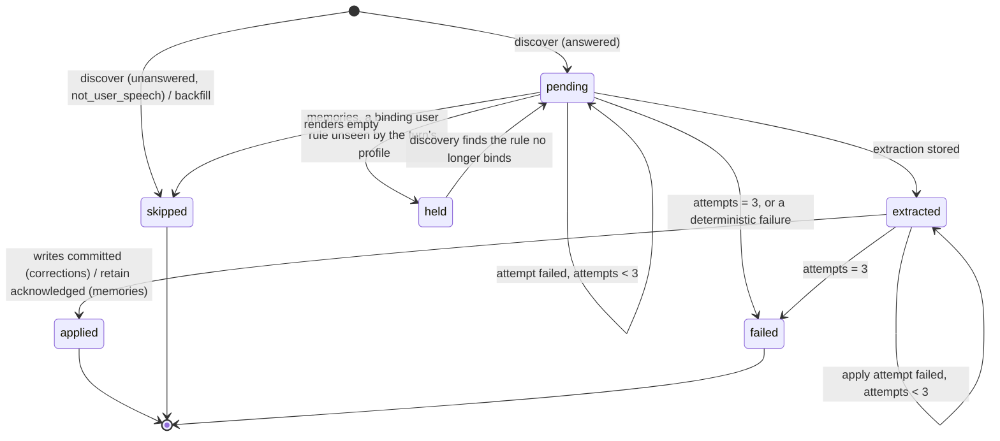

# Observation by Turn `[proposed]`

The Observer ([evolution.md](evolution.md#observer-and-consolidation-confirmed), [memory.md](memory.md#observer-pattern-post-conversation-extraction-confirmed)) extracts corrections and memories from a conversation's **turns**, one turn at a time and in order. Each turn and phase has a state row. Every write is keyed on the turn's durable identity, and nothing the model produces is used as a key. The idle trigger stays as the debounce. Each fire works through the turns not yet observed, up to a cap, and asks for a follow-up fire while a backlog remains.

This is a document of its own because it specifies a data model, a state machine and a failure contract that both extraction phases share. evolution.md and memory.md keep the extraction semantics (what a correction is, what a fact is, the rules each obeys) and link here for how the Observer moves through a conversation.

Industry practice it follows:

- **Mem0** extracts from each new user/assistant exchange, given a running summary and the last ~10 messages.
- **Zep/Graphiti** ingests one episode at a time, keyed by episode id.
- **LangMem** debounces before extracting.

## The Unit `[proposed]`

### Definition

A **turn** is the set of `messages` rows in one conversation that share a `last_inbound_message_id`, the **turn cursor**. Both writers stamp every row they write for a turn with that cursor:

- **Chat turns.** `handle-message`'s `create-user-message` and `persist-new-messages` use the batch's last inbound.
- **Pipeline stage turns.** `run-agentic-stage`'s `persist-stage-prompt` and `persist-new-messages` use the stage's prompt inbound.

No other code inserts messages.

**Identity.** A turn's durable id is `(conversation_id, turn_cursor)`. Inbound ids are UUIDv7 and unique across conversations, so the cursor alone also names the turn. That is what external keys (Hindsight document ids) use. The cursor is not a foreign key: `inbound_messages` rows are its source, but `messages` never referenced them.

**Parts of a turn.** All of them share the cursor:

| Part | Rows | How it is told apart |
|-|-|-|
| Turn row | The newest user row that `isTurnRowContent` accepts (no `tool_result` block, no `HARNESS_ROW_TAGS` block), as `findUserMessageByInbound` finds it | Content predicate |
| Earlier duplicate turn rows | Older user rows the same predicate accepts, left when `create-user-message` re-ran after its commit | Same predicate, not the newest |
| Tool rounds | Assistant rows with `tool_use` blocks, and user rows with `tool_result` blocks | Block type |
| Harness rows | The continuation prompt (user `text`, `harness: "continuation"`) and the volume nudge (`tool_result`, `harness: "volume_nudge"`) | Harness tag |
| Reply | Assistant rows with text. The last one is the final reply, which may carry a `truncation_notice` block or be the degraded reply | Role and block type |

**Order.** Turns are ordered by the smallest row id in each group. Rows are UUIDv7, and a turn's turn row is written before its replies, so this is arrival order. Grouping is by cursor, not by adjacency, so a pipeline stage's rows interleaving with a chat turn's still form two turns.

**Kind.** Read once, at discovery, from `inbound_messages.source` for the cursor, and stored on the observation row so it never needs a second read:

- `user` gives a `chat` turn;
- `scheduled` gives a `scheduled` turn;
- `pipeline` gives a `pipeline` turn;
- a missing inbound row (fixtures, rows that predate inbound buffering) gives `chat`.

**Answered.** A turn is answered when at least one assistant row carries its cursor. `persist-new-messages` writes all of a turn's assistant rows in one transaction, so a turn becomes answered atomically and its row set is final once it is.

**Profile.** Every row of a turn carries the turn's `profile_id` snapshot (design/transport/overview.md → Profile and Model Stamping). The Observer uses the **turn's** profile, not the conversation's current one, for:

- the extraction model (`extractionModel ?? model`);
- `seesUserRules` (`admitsFirstParty`);
- the `profile_class` tag.

A `/profile` switch mid-conversation therefore observes each turn under the profile it ran under.

**Channels.** Correction scoping reads the turn's `turn_contexts.context.channelTypes` (keyed to the turn row). It falls back to `getActiveChannelTypes` only for a turn row with no stored context.

### Disposition at discovery

| Group | Disposition |
|-|-|
| Answered `chat` turn | Observed in both phases |
| Answered `scheduled` or `pipeline` turn | Memories observed. Corrections skipped as `not_user_speech`: its user row is a task prompt, not the user's words. The user's reaction to its reply arrives in the next chat turn, which carries this turn as context. |
| Unanswered, with a later turn in the conversation | Skipped in both phases as `unanswered`. A failed chat turn writes no assistant row, so the next chat turn re-batches its inbounds into its own turn row ([attachments.md](transport/attachments.md)), and its words are observed there. A pipeline stage that kept nothing wrote only a prompt the pipeline authored. |
| Unanswered and last | Not discovered: in flight, or awaiting its retry. A later fire decides. |

### Rendering a turn

- **Included:** the turn row, the tool rounds, and the replies.
- **Dropped:**
  - earlier duplicate turn rows;
  - harness prompts (`isHarnessPrompt`);
  - images and thinking blocks;
  - the turn context's rendered block. Recalled memories are reference data from Hindsight, so extracting them again would feed memories back into themselves.
- **Kept:** the truncation notice, which is part of the reply.
- **Tool calls** render as `[Tool: name(input)] → result`, as `formatTranscript` does today.
- **Forwarded text** stays inside its `<forwarded_message>` element.

### Edge cases

1. **Debounced batch.** Several inbounds give one turn row, and the cursor is the batch's last inbound.
2. **Duplicate turn row** (an insert re-run after its commit). The group still has one cursor and one turn, and the newest turn row is the one rendered.
3. **Duplicate reply rows** (`persist-new-messages` re-run after its commit). The turn renders them twice, but it is still one unit with one extraction. Apply collapses that extraction's items on the same target, so the turn reinforces or contradicts a rule at most once.
4. **Degraded turn.** The degraded reply is the final assistant row, so the turn is answered and observed. Its kept tool rounds are part of it, and the dropped iteration was never persisted.
5. **Continuation prompt and volume nudge.** They belong to the turn and are not rendered. A continuation prompt never becomes a turn row: `isTurnRowContent` rejects it.
6. **Cooldown reply.** Writes no `messages` row, so it is no turn.
7. **Summaries.** `conversation_summaries` rows are context, never turns. A summary whose `through_message_id` falls inside a turn doesn't split it.
8. **Turn in flight at discovery.** If the turn row has committed but `persist-new-messages` hasn't, the turn is unanswered and last, so it is not discovered. Discovery is an anti-join, not a cursor, so the next fire finds it however late its transaction commits.
9. **Mixed profiles in one conversation.** Each turn is observed under its own profile. A fire may resolve several extraction models.
10. **Deleting a conversation.** Its turns and observation rows go with it (`ON DELETE CASCADE`). Messages are never deleted on their own.

## State Machine `[proposed]`

### Storage

The state lives in a table, `turn_observations`, with one row per turn and phase. Owned by `agent/store/schema.ts`.

Why not columns:

- **On `messages`:** that would put mutable processing state on append-only rows.
- **On `conversations`:** that is a cursor again, the unit without identity.
- **Two status columns on one row per turn:** that would couple the phases' lifecycles, and every future phase would need a migration of its own.

With one row per turn and phase, the phases advance independently (they fail independently), and a new phase is a new enum value.

| Column | Type | Notes |
|-|-|-|
| `id` | UUIDv7 PK | DB-generated. The step-id suffix and the provenance reference. |
| `conversation_id` | UUID NOT NULL | FK → `conversations.id` `ON DELETE CASCADE`. Processing state, not audit. |
| `turn_cursor` | UUID NOT NULL | The turn's `last_inbound_message_id`. Not an FK. |
| `turn_kind` | pgEnum `turn_kind` NOT NULL | `chat`, `scheduled`, `pipeline` |
| `phase` | pgEnum `observation_phase` NOT NULL | `corrections`, `memories` |
| `status` | pgEnum `observation_status` NOT NULL | `pending`, `held`, `extracted`, `applied`, `failed`, `skipped` |
| `skip_reason` | pgEnum `observation_skip_reason`, nullable | Set exactly when `status = 'skipped'`: `unanswered`, `not_user_speech`, `empty`, `backfilled` |
| `attempts` | integer NOT NULL | Failed processing attempts. Written explicitly (0) at insert, with no default. |
| `extraction` | JSONB, nullable | `TurnExtractionSchema`, via `jsonbZod`. Set exactly when `status IN ('extracted', 'applied')`. |
| `failure` | JSONB, nullable | `ObservationFailureSchema` (`{ kind, message }`, the last failure). Set when `attempts > 0`. |
| `updated_at` | TIMESTAMPTZ NOT NULL | Set by every transition |
| `created_at` | TIMESTAMPTZ NOT NULL | `now()` default |

Constraints and indexes:

- `UNIQUE (conversation_id, turn_cursor, phase)`.
- A partial index on `(conversation_id, phase)` `WHERE status IN ('pending', 'held', 'extracted')`, which serves planning.
- CHECK `chk_turn_observations_state`:

  ```sql
  (status = 'skipped') = (skip_reason IS NOT NULL)
  AND (status IN ('extracted', 'applied')) = (extraction IS NOT NULL)
  AND (attempts > 0) = (failure IS NOT NULL)
  AND (status <> 'held' OR phase = 'memories')
  AND (status <> 'failed' OR attempts > 0)
  AND (skip_reason <> 'not_user_speech' OR (phase = 'corrections' AND turn_kind <> 'chat'))
  ```

`extraction` groups atomic state ([architecture rules](../.claude/rules/architecture-rules.md)): the items, the run that wrote them, what rendering dropped (truncation), and what the evidence check dropped are written together, once, and never rewritten.

### States and transitions



| From | To | By | Conditional UPDATE guard |
|-|-|-|-|
| — | `pending` / `skipped` | `discoverTurns` | `INSERT … ON CONFLICT (conversation_id, turn_cursor, phase) DO UPDATE SET updated_at = turn_observations.updated_at RETURNING (xmax = 0)`, the no-op-SET shape from [inngest.md](../.claude/rules/inngest.md) |
| `pending` | `held` | `extractTurn` (memories) | `WHERE id = $1 AND status = 'pending'` |
| `held` | `pending` | `discoverTurns` | `WHERE id = ANY($1) AND status = 'held'`, for the held turns whose profile no longer sees a binding unseen rule |
| `pending` | `extracted` | `extractTurn` | `WHERE id = $1 AND status = 'pending'`, setting `extraction` (carrying `runId`) |
| `pending` | `skipped` (`empty`) | `extractTurn` | `WHERE id = $1 AND status = 'pending'` |
| `pending`, `extracted` | same status, `attempts + 1` | `recordTurnAttempt` | `WHERE id = $1 AND status = $from AND attempts = $seen` |
| `pending`, `extracted` | `failed` | `recordTurnAttempt` | Same guard. Taken when `attempts + 1 = MAX_ATTEMPTS` (3) or the failure is deterministic. |
| `extracted` | `applied` | `applyTurnCorrections` / `retainTurnMemories` | `WHERE id = $1 AND status = 'extracted'`. For corrections, the first statement of the transaction that writes the rules. |

**Illegal**, so no store method expresses them:

- any transition out of `applied`, `skipped` or `failed`. Only a future operator command reopens a `failed` row, `failed → pending` with `attempts` reset;
- `extracted → pending`, which would discard a stored extraction that Hindsight document ids are positioned on;
- `pending → applied` without an extraction;
- `held` in the corrections phase, which the CHECK rejects;
- rewriting `extraction`.

Every transition reports whether it moved. The use case reads `{ kind: "moved" } | { kind: "notInState"; actual }` and decides what that means. Re-entry guards live inside the steps, and the bare body branches only on memoized outcomes ([inngest.md](../.claude/rules/inngest.md) → Never gate the bare body on state your own steps mutate).

### One turn, one phase, one fire

| Step id | Body | Returns (memoized) |
|-|-|-|
| `discover-turns` | One transaction: group the turns, insert rows for undiscovered turns, release held turns no binding rule holds any more, and read the plan for both phases | `ObservationPlan`: per phase, up to the cap of turn refs, plus `remaining` |
| `observe-<phase>-extract-<observationId>` | Read the row. If it is `extracted` or `applied`, return what it holds and call no model. Otherwise render the turn and its context, check `held`, call the model, check evidence, and write `extracted` with this run's id. | `ExtractOutcome` |
| `observe-<phase>-apply-<observationId>` | Read the stored extraction from the row, not from step state. Corrections: one transaction moves `extracted → applied` and then writes the rules. Memories: `retainBatch` with positional document ids, then `extracted → applied`. | `ApplyOutcome` |
| `observe-<phase>-attempt-<observationId>` | Runs only after one of the steps above failed after its retries. Records the attempt. | `AttemptOutcome` |
| `request-follow-up` | Sends `observer/backlog`, with an event id derived from the conversation and the last planned observation id. Planned only when work remains and the fire moved a turn. | — |

`observationId` is the DB-minted id from the memoized plan. Step ids never contain model output, a clock or a fresh uuid.

## Types and Boundaries `[proposed]`

Sealed unions, matched with ts-pattern `.exhaustive()`. `Result` at use-case boundaries. Branded value types and readonly data, as in [tooling.md](tooling.md#kotlin-developer-patterns).

```typescript
// Value types
type ConversationId = Brand<string, "ConversationId">;
type TurnCursor = Brand<string, "TurnCursor">;            // messages.last_inbound_message_id
type TurnObservationId = Brand<string, "TurnObservationId">;
type ObservationRunId = Brand<string, "ObservationRunId">; // Inngest runId; a fresh uuid per /reflect call
type ObservationPhase = "corrections" | "memories";        // pgEnum observation_phase
type TurnKind = "chat" | "scheduled" | "pipeline";         // pgEnum turn_kind
type SkipReason = "unanswered" | "not_user_speech" | "empty" | "backfilled";

interface TurnRef {
  readonly observationId: TurnObservationId;
  readonly conversationId: ConversationId;
  readonly cursor: TurnCursor;
  readonly kind: TurnKind;
  readonly phase: ObservationPhase;
}

// The state a row holds. Parsed from the row at the store boundary, so an
// incoherent row is a parse error, not a branch.
type TurnObservationState =
  | { readonly status: "pending"; readonly attempts: number }
  | { readonly status: "held"; readonly attempts: number }
  | { readonly status: "extracted"; readonly attempts: number; readonly extraction: TurnExtraction }
  | { readonly status: "applied"; readonly extraction: TurnExtraction }
  | { readonly status: "failed"; readonly attempts: number; readonly failure: ObservationFailure }
  | { readonly status: "skipped"; readonly reason: SkipReason };

type TurnExtraction =
  | {
      readonly phase: "corrections";
      readonly runId: ObservationRunId;
      readonly items: ReadonlyArray<CorrectionItem>;  // rule labels already resolved to rule ids
      readonly dropped: { readonly noEvidence: number; readonly unknownRule: number };
      readonly truncation: Truncation | null;
    }
  | {
      readonly phase: "memories";
      readonly runId: ObservationRunId;
      readonly items: ReadonlyArray<MemoryItem>;      // position = document id suffix
      readonly dropped: { readonly noEvidence: number };
      readonly truncation: Truncation | null;
    };

type ObservationFailure =
  | { readonly kind: "budget"; readonly message: string }       // deterministic: fails at once
  | { readonly kind: "provider_rejected"; readonly message: string } // non-retriable 4xx: fails at once
  | { readonly kind: "provider"; readonly message: string }     // transient, out of step retries
  | { readonly kind: "parse"; readonly message: string }        // chatTyped's repair exhausted
  | { readonly kind: "hindsight"; readonly message: string }
  | { readonly kind: "store"; readonly message: string };

// Step outcomes: small, JSON-safe, the only things the bare body branches on
type ExtractOutcome =
  | { readonly kind: "extracted"; readonly items: number }
  | { readonly kind: "resumed" }                               // this run's extraction, stored earlier
  | { readonly kind: "taken"; readonly by: ObservationRunId }  // another run stored one first
  | { readonly kind: "held" }
  | { readonly kind: "skipped"; readonly reason: "empty" }
  | { readonly kind: "terminal"; readonly status: "applied" | "failed" | "skipped" };

type ApplyOutcome =
  | { readonly kind: "applied"; readonly counts: PhaseCounts }
  | { readonly kind: "alreadyApplied" };

type AttemptOutcome =
  | { readonly kind: "retryLater"; readonly attempts: number }
  | { readonly kind: "failed"; readonly attempts: number };

// The aggregate: one conversation's turns and their observation rows.
// Pure; built from one read, never mutated; plans what a fire does.
class ConversationObservation {
  static from(
    groups: ReadonlyArray<TurnGroup>,
    rows: ReadonlyArray<TurnObservationRow>,
  ): Result<ConversationObservation, ObservationInvariantError>;
  /** Rows discovery must insert: answered turns without one, and skips. */
  undiscovered(): ReadonlyArray<NewTurnObservation>;
  /** Held turns whose profile is not in `stillBinding`: discovery moves them back to `pending`. */
  releasable(stillBinding: ReadonlySet<ProfileId>): ReadonlyArray<TurnObservationId>;
  /** Up to `limit` `pending`/`extracted` turns of `phase`, in turn order, and how many remain beyond. */
  plan(phase: ObservationPhase, limit: number): PhasePlan;
}

interface PhasePlan {
  readonly phase: ObservationPhase;
  readonly turns: ReadonlyArray<TurnRef>;
  readonly remaining: number;
}

// Use cases: one file each, (deps, args) => ResultAsync
function discoverTurns(deps: DiscoverDeps, args: { conversationId: ConversationId }):
  ResultAsync<ObservationPlan, ObservationError>;
function extractTurn(deps: ExtractDeps, args: { turn: TurnRef; runId: ObservationRunId }):
  ResultAsync<ExtractOutcome, ObservationError>;
function applyTurnCorrections(deps: ApplyCorrectionsDeps, args: { turn: TurnRef }):
  ResultAsync<ApplyOutcome, ObservationError>;
function retainTurnMemories(deps: RetainMemoriesDeps, args: { turn: TurnRef }):
  ResultAsync<ApplyOutcome, ObservationError>;
function recordTurnAttempt(deps: AttemptDeps, args: { turn: TurnRef; failure: ObservationFailure }):
  ResultAsync<AttemptOutcome, ObservationError>;

type ObservationError =
  | { readonly kind: "transient"; readonly failure: ObservationFailure }     // the step throws it, for Inngest's retry
  | { readonly kind: "deterministic"; readonly failure: ObservationFailure } // recorded as a terminal attempt
  | { readonly kind: "invariant"; readonly detail: string };                 // a bug: thrown, never recorded
```

**Aggregate invariants** (`ConversationObservation.from` rejects a read that breaks one, as an `invariant` error):

1. There is at most one row per turn and phase.
2. Every row's turn exists among the groups. Messages are deleted only with their conversation.
3. `plan` returns `pending` and `extracted` turns in turn order, never a terminal or `held` one. A phase's turns run in that order. The fire stops a phase at its first `retryLater` or `taken`, so a later turn is never applied ahead of an earlier one that can still succeed.
4. `held` turns neither block a phase nor take a place in its plan. Otherwise a run of held third-party turns would fill every plan and starve the first-party turns after them. Discovery releases a held turn to `pending` once nothing binds it any more. Holding a fact from turn 5 doesn't change what turn 6 means, so order matters less for facts.

**Where a throw is allowed.** Only in the step wrapper: an `Err` of kind `transient` is thrown so Inngest retries the step. Everything expected (held, taken, empty, a deterministic failure, an already-terminal row) is an `Ok` outcome or a `deterministic` `Err`, matched exhaustively. When a step fails for good, its `StepError` reaches the body. The body catches it around the extract or apply step only, which is the [inngest.md](../.claude/rules/inngest.md) carve-out for a catch whose target is the designed failure channel, and runs `observe-<phase>-attempt-<observationId>`.

**Files** (`src/agent/evolution/observation/`), each a pure module or one use case:

- `turns.ts`: `groupTurns`, `classifyTurn`, `renderTurn`;
- `conversation-observation.ts`: the aggregate;
- `budget.ts`;
- `discover-turns.ts`;
- `extract-turn.ts`: dispatches on phase to `extract-corrections.ts` and `extract-memories.ts`, which become pure prompt-and-parse modules over one rendered turn;
- `apply-turn-corrections.ts`;
- `retain-turn-memories.ts`;
- `record-turn-attempt.ts`.

`observer.ts` keeps only Inngest wiring and the per-fire loop, with consolidation and the drain unchanged.

The store is `ObservationStore` / `DrizzleObservationStore` in `src/agent/store/`: stateless, `tx` first. It has the reads `listTurnGroups`, `listTurnObservations`, `getTurnObservation` and `loadTurnInput`, and one method per row of the transition table. Transforms use Remeda (`groupBy` on the cursor, `sortBy` on min row id, `countBy` for audit counts).

## Context `[proposed]`

Each extraction gets the turn and, before it, labelled context:

```
<earlier_conversation>   already observed; use only to resolve references
  <summary>…</summary>   newest conversation_summaries row whose through_message_id precedes the turn's first row
  <turn>…</turn>          previous turn(s), newest last
</earlier_conversation>
<turn>…</turn>            the turn being observed; extract only from here
```

**What the context holds.** The previous two answered turns, each rendered as:

- its user text;
- its final reply;
- its tool calls collapsed to `[Tool: name]`.

Corrections need this most: a correction in turn N reacts to turn N−1's reply.

**Budget.** It comes from `resolveLimits` / `computeBudget` for the extraction model. After the system prompt, the turn gets up to half, and the context up to a quarter.

**Allocation.** Context is filled in priority order, and every message is capped individually (head and tail kept, the cut marked `[… N characters truncated]`). The order is:

1. turn N−1's final reply;
2. turn N−1's user text;
3. the summary;
4. turn N−2.

A huge earlier message is cut to its share and never pushes out the exchange right before the turn.

**Truncating the turn.** A turn over its share is truncated in this order:

1. tool results;
2. tool inputs;
3. replies;
4. the user's text last (head and tail).

What was cut is recorded in `extraction.truncation` and counted in the audit row. The turn is still processed whole, and there is no intra-turn position to lose a tail past.

**Too small.** A model whose budget can't hold the system prompt plus a minimal turn fails at once as `budget` (deterministic). One whose budget can't fit the context sends the turn without it, and the truncation records that.

**Context cannot double-count.** Every write is keyed on the turn being observed, and a turn is applied once (`extracted → applied`):

- **Re-extraction cannot repeat writes.** Re-extracting turn N — a retried step, a run in flight across a deploy, a concurrent `/reflect` — finds the stored extraction or loses the conditional UPDATE, so it never writes twice.
- **Context items are filtered by evidence.** Context can still be misread as new, with the model reporting a correction from turn N−1 while observing turn N. That item is attributed to N and would reinforce a second time. The evidence check below filters it.

**Evidence, not citations.** The unit is one turn, so there is nothing to number. Each item carries `evidence`, a short verbatim quote, checked after normalizing case, whitespace and quote marks (the `rule_set` quote check's normalization):

| Phase | The quote must appear in |
|-|-|
| Corrections | The turn's user text, typed or transcribed. Forwarded text and documents don't count. A correction is the user's own reaction. |
| Memories | Any rendered text of the turn, tool results included, since facts come from tool output too |

An item that fails is dropped and counted (`dropped.noEvidence`). The quote filters items. It is never a key, so a paraphrased quote costs one item and changes no identity. The eval reports the drop rate, and a high one is a prompt problem, not a correctness problem.

## Writes and Keys `[proposed]`

### Corrections

The apply transaction runs in this order:

1. `UPDATE turn_observations SET status = 'applied' … WHERE id = $1 AND status = 'extracted' RETURNING extraction`. No row back means the turn is already applied, so it writes nothing.
2. The stored items, collapsed to one action per target rule. A contradiction wins over a reinforcement of the same rule.
3. The writes, through `upsertCorrection` and `contradictLearningRule`, unchanged except for the contradiction marker.

Under REPEATABLE READ, a concurrent apply of the same row blocks on the row lock and then fails with `40001`. The transactor retries it against a snapshot where the row is `applied`, so it writes nothing. A reinforcement is applied exactly once per turn, because the rule writes and the transition commit together.

**The contradiction marker** is `steering_rules.contradicted_in_turn_id UUID REFERENCES turn_observations(id) ON DELETE SET NULL`. It replaces `contradicted_in_conversation_id`.

- The first contradiction of a rule still learning resets the rule and records the corrections row of its turn.
- A contradiction from any other turn, in this conversation or another, retires the rule.
- A contradiction from the recorded turn changes nothing. That is a backstop, since a turn applies once.

A rule contradicted twice in one long chat now retires. Any other retirement clears the marker, as today.

### Memories

- **Document ids.** Each stored item retains under `observer:turn:<turn_cursor>:<position>`, where `position` is the item's index in the stored `extraction.items`.
- **Re-sends.** `retainBatch` is a replace on `document_id` (Hindsight `update_mode: "replace"`, the default), so a re-sent batch names the same documents with the same content.
- **Stable positions.** The extraction is stored before the retain and never rewritten, so positions never shift. A re-run cannot find fewer facts, because it never re-extracts an extracted turn.
- **Tags.** As today: `network:`, `compartment:` and `trust:` come per item, and `profile_class:` comes from the turn's profile.

**Held.** The memories phase checks `bindsUnseenUserRule` against the rules the turn's profile sees:

- **Inside the extract step, before any model call.** If one binds, the turn goes `pending → held`.
- **On every fire.** `discover-turns` reads the memory rules once for the profiles of the held turns. Once nothing binds a turn (the rule is retired, or the p2 first-party-model mode lands), it releases the turn `held → pending`, and the turn is planned like any other.
- **At retain.** The retain step re-checks too. If a binding rule appeared after extraction, it doesn't retain: the outcome is `held` and the row stays `extracted` until a fire whose check passes.

## Failure Modes `[proposed]`

| # | Crash or retry point | Resulting state | Why it is safe, or the residual |
|-|-|-|-|
| 1 | Inside the extract step, before the model returns | `pending` | Nothing is written. The step retry calls the model again, which is the one billable re-run. |
| 2 | After the model, before the `extracted` UPDATE commits | `pending` | Same as 1 |
| 3 | After `extracted` commits, before Inngest records the step | `extracted`, `runId` = this run | The re-run reads the row, sees its own run id, returns `resumed`, and calls no model |
| 4 | Between extract and apply | `extracted` | The re-invocation replays extract from cache and runs apply, which reads the extraction from the row |
| 5 | Inside the corrections apply transaction | `extracted` (rolled back) | The rule writes and the transition roll back together. The retry applies once. |
| 6 | After the apply transaction commits, before Inngest records the step | `applied` | The re-run's guarded UPDATE matches no row, returns `alreadyApplied`, and writes nothing |
| 7 | Hindsight acknowledges the retain, then the step fails before `extracted → applied` | `extracted` | The retry re-sends the stored items under the same document ids, which Hindsight replaces, then transitions |
| 8 | Hindsight write fails after the step's retries | `extracted`, `attempts + 1` | The attempt is recorded. The next fire retries the retain from the stored extraction, with no model call. After 3 attempts the row is `failed` and visible. |
| 9 | Extraction fails after the step's retries (provider, parse) | `pending`, `attempts + 1`; `failed` at 3 | The phase stops for this fire to keep order. A turn that always fails stalls its phase for at most 3 fires, then is passed. |
| 10 | Deterministic failure (`budget`, a non-retriable 4xx) | `failed` at once | Non-retriable, so no Inngest retries and no further fires. The phase moves past it. |
| 11 | Function-level retry (an error outside a step) | Unchanged | Steps replay from cache, the DB is the authority, and every transition is guarded |
| 12 | A run in flight across a deploy, whose new code plans different step ids | Whatever the DB holds | New step ids re-run their bodies. Discovery is an idempotent upsert. Extract short-circuits on `extracted`/`applied`. Apply is guarded. Residual: a `pending` turn whose model call was in flight is billed once more. Memoized outcomes are parsed with Zod, and one that doesn't parse is treated as absent: the step's body re-reads the row. |
| 13 | Concurrent `/reflect` and an idle fire | Each row moves once | Both may call the model for the same `pending` turn. The first `extracted` UPDATE wins, and the loser gets `taken` and stops that phase. Writes happen once (5, 6), and retains are idempotent (same stored items, same ids). Residual: one duplicate model call per phase. |
| 14 | A turn's persist transaction commits after discovery's snapshot | Not discovered this fire | No cursor runs past it. The next fire's anti-join finds it. |
| 15 | Hindsight accepts an async retain, then fails processing it server-side | `applied` | As today: `async: true` acknowledges a queued batch. Residual, not new. |
| 16 | A rule merged or retired between extract and apply | `applied` | Apply resolves stored rule ids against live rows. A missing or retired target counts as `unknownRuleReinforcementsSkipped`, as today. |
| 17 | A memory rule set between extract and retain | `extracted` (third-party) or `applied` (first-party) | A third-party turn is held at retain. A first-party turn's extraction was prompted without the rule. Residual: a rule set in that seconds-wide window binds from the next turn on. |

## Failure Classes Excluded `[proposed]`

| Failure class | Mechanism |
|-|-|
| The backlog never drains after a capped fire | A fire with `remaining > 0` that made progress (at least one transition) sends `observer/backlog` as its last step. The event id is derived from the conversation and the last planned observation id, so a replay sends it once. The Observer triggers on `conversation/idle` and `observer/backlog` under one concurrency key. A fire with no progress (only `retryLater` or `held`) doesn't re-emit, and the next idle resumes. |
| Keys chosen by the model | Keys are the turn cursor, the phase, the DB-minted observation id, and an item's position in the stored extraction. Rule labels are resolved to ids at extraction and stored. The model's `evidence` filters items and never keys anything. |
| Truncation losing a message's tail past the cursor | There is no intra-turn cursor. A turn is processed whole, and what rendering cut is recorded (`extraction.truncation`, `truncatedTurns` in the audit row). Residual: cut text isn't extracted, visibly. |
| A unit that always fails stalls its phase | `attempts` with `MAX_ATTEMPTS = 3`, recorded per fire, then `failed`. Deterministic failures go to `failed` at once. A `failed` turn no longer blocks, and the audit row counts it. |
| Partial phases hidden in `/learned` | Per-phase turn counts in the audit row (`turns.<phase>`: applied, held, retried, failed, skipped by reason, taken, remaining), rendered in `/learned` and the web table |
| Context lost when one large message precedes the turn | A context budget with per-message caps, allocated to the immediately preceding exchange first |
| Invisible skip reasons | `skip_reason` is a pgEnum on the row. `held` is a status. The audit row counts both by reason. |
| A run in flight across a deploy re-extracting under new step ids | The DB state machine is the authority, and an extracted or applied turn is never extracted again (row 12) |
| Concurrent `/reflect` and an idle fire processing twice | Guarded transitions with the writing run's id, `taken` stopping the loser, and the apply transaction committing writes and transition together (row 13) |

## Audit and Read Surface `[proposed]`

`EvolutionEventPayloadSchema` gains `turns`, optional so older rows parse:

```typescript
interface PhaseTurnCounts {
  readonly applied: number;
  readonly held: number;
  readonly retried: number;       // attempts recorded, still retryable
  readonly failed: number;
  readonly skipped: Readonly<Partial<Record<SkipReason, number>>>;
  readonly taken: number;
  readonly truncated: number;
  readonly droppedNoEvidence: number;
  readonly remaining: number;     // non-terminal turns beyond this fire's plan
}
type TurnsPayload = { readonly corrections: PhaseTurnCounts; readonly memories: PhaseTurnCounts };
```

`corrections` and `memories` keep their item counts. `failedPhases` keeps meaning a phase-level failure: consolidation, drain, or a plan that couldn't be read. `messageCount` is no longer written once both phases run by turn. `triggered_by` gains `follow_up`.

- **Fires that write a row.** A fire writes a row when it moved at least one turn or the drain moved rows. Otherwise it returns `skipped: "nothing_new"`, which replaces `too_short` and `MIN_MESSAGES_FOR_EXTRACTION`. A short conversation's turns are observed like any other's.
- **`/learned`.** The digest line adds `turns 3 (1 held, 2 left)`. The detail view lists the per-reason counts.
- **`/reflect`.** Runs the same loop with a fresh run id and sends the follow-up event when work remains. It answers "Nothing new since the Observer last ran." for `nothing_new`.

## Backlog and Backfill `[proposed]`

**Cap.** `TURNS_PER_PHASE_PER_FIRE = 10`. A fire plans at most 2 steps per turn per phase, about 40 steps with the fixed ones, and the bare body replays without model calls.

**Cost.** One model call per turn per phase, against one per fire today. Each call is small (one turn plus capped context), and the system prompt is identical across calls, so it is cached. A never-observed conversation drains over successive follow-up fires.

**Backfill.** Existing conversations' turns are marked from `evolution_events` by a custom data migration (`drizzle-kit generate --custom`), one per phase, each shipping in the PR that moves that phase to turns. Every fire before turns read the whole transcript by id and recorded its length as `messageCount`. Messages are deleted only with their conversation, so the read covered exactly the first `messageCount` messages by id. For each conversation and phase, the boundary is the `messageCount`-th message by id of the latest qualifying fire.

A fire qualifies for a phase when:

- it didn't fail the phase (not in `failedPhases`; a row without the field failed none);
- for memories, it didn't hold them (`memories.skippedForUnseenRules` is 0 or missing);
- its `messageCount` is present and no larger than the conversation's message count.

Effect of the backfill:

- **Answered turns entirely at or below the boundary** get a `skipped` (`backfilled`) row for the phase.
- **Everything else gets no row**, so discovery inserts it as `pending`. That covers:
  - a turn straddling the boundary (a fire landing between a turn row and its replies);
  - every turn of a phase with no qualifying fire;
  - every turn of a conversation the Observer never fired on.

Residual: the straddling turn, at most one per conversation, is observed again. A correction in it can reinforce once more, and a fact in it is retained under a turn document id beside the transcript-era document.

**`contradicted_in_conversation_id`.** For each non-null value, the corrections backfill sets `contradicted_in_turn_id` to the newest `backfilled` corrections row of that conversation. A conversation with none leaves it NULL, so that rule's next contradiction resets it rather than retiring it. A later migration drops the old column (Rollout).

**Ordering between the two backfills.** Until memories move to turns, memory extraction still reads the whole transcript and fires still record `messageCount`. The memories backfill therefore sees an exact boundary whenever it ships.

## Hindsight Raw Retain `[proposed]`

Research against Hindsight `v0.10.2` and the pinned `@vectorize-io/hindsight-client` 0.10.1 (`cogmo.hindsightCompat` `>=0.10.0 <0.11.0`):

- **`document_id` is a per-bank upsert.** `update_mode: "replace"` (the default) deletes the document and every fact extracted from it before reprocessing. `"append"` concatenates and reprocesses. Both diff chunks by hash, so unchanged chunks keep their facts (hindsight-docs `developer/api/retain.mdx`; client `MemoryItem.update_mode`).
- **Item `tags` are the document's tag set**, copied to every fact extracted from it (hindsight-api `engine/retain/fact_storage.py`).
- **Per-fact tags exist only through bank config `entity_labels`.** These are label groups with a key, a description, a type (`value`, `multi-values`, `text`, …), allowed values, and `tag: true`. The last writes each fact's `key:value` into that fact's tags, which is cogmo's `network:x` / `compartment:y` / `trust:z` syntax.
  - Values outside the list are dropped silently.
  - Removing a value doesn't relabel stored facts.
  - Labels, `retain_mission` and `retain_custom_instructions` are per-bank, or per named `retain_strategies` entry, which an item selects with `strategy` (hindsight-docs `developer/api/memory-banks.mdx`, `configuration.mdx`; client `LabelGroupInput`, `BankConfig`).
- **Hindsight's own fact types don't map to cogmo's networks.** Extraction yields `world` and `experience` (the assistant's own actions). `observation` comes only from consolidation, and `opinion` was removed. Cogmo's world/bank/opinion/observation split would need a `network` label group.
- **Input format.** `content` takes text or a JSON `{role, content}` array, split at turn boundaries. Speaker attribution comes from `context`. `timestamp` anchors relative dates.

**Verdict: possible, not a drop-in. Keep cogmo's extraction for this design.** A raw per-turn retain is one document, `observer:turn:<turn_cursor>`, with `update_mode: "replace"`, document-level tags `profile_class:` and `source:conversation`, and per-fact `network`, `compartment` and `trust` through per-bank `entity_labels`. A bank is a user, so the labels can be synced from that user's `custom_compartments`. It would:

- remove one of today's two extraction passes (cogmo extracts facts, then Hindsight extracts again from each);
- make a re-run exact, since replace deletes the turn's previous facts.

What is missing or costly:

1. **`memory`-category rules.** Hindsight's only extraction steering is `retain_mission` or custom instructions, per bank or per strategy. Rules visible per profile would have to be synced into one strategy per profile, a second copy of the rules that can drift. The `held` semantics stay cogmo-side.
2. **Validation.** An out-of-list label is dropped silently, where cogmo's Zod schema rejects it and repairs.
3. **Label lifecycle.** Renaming or removing a custom compartment leaves old facts labelled. Today's path has the same property per fact, but the labels would now live in two places.
4. **Network semantics.** `opinion` (the agent's assessments) and `observation` (patterns) become prompt-described labels on Hindsight's extractor, which runs on the Hindsight server's model rather than the profile's.
5. **Pending memories.** `memory_retain` and skill rows still need classifying, or a strategy carrying the same labels.

Recommendation: a later spike behind a flag, measured on the memory routing eval ([memory.md](memory.md#evaluation)) against per-turn cogmo extraction. The turn state machine is unchanged by it: the memories phase's extraction becomes `{ phase: "memories"; mode: "raw" }`, and apply is the one retain.

## Rollout `[proposed]`

Each PR is shippable and reviewable on its own. Migrations follow main's `0068_steering_rule_contradicted_in`. Numbers shift if other migrations land first, so the names are what matter.

1. **Turn model and store.** Contents:
   - `groupTurns`, `classifyTurn` and `renderTurn`, with tests for every edge case in [The Unit](#the-unit-proposed);
   - `ConversationObservation`;
   - `ObservationStore`, with every transition and its PGlite tests, including the illegal ones as absent methods and as CHECK violations;
   - `0069_turn_observations`, generated: the enums, the table, `steering_rules.contradicted_in_turn_id`, and the `follow_up` trigger value.

   No behaviour change. Its consumers land in PR 2, so a reviewer who prefers no unconsumed code takes 1 and 2 together.
2. **Corrections by turn.** Contents:
   - `discoverTurns`, the extract, apply and attempt use cases for corrections, and the evidence check;
   - the per-fire loop, the follow-up event and the run id;
   - `turns.corrections` in the audit row, `/learned`, `/reflect` and the web table;
   - `contradictLearningRule` on `contradicted_in_turn_id`;
   - `0070_turn_observations_corrections_backfill`, custom.

   Memories still read the transcript, so `messageCount` is still written. Tests: each Failure Modes row that applies to corrections as a replay test (`@inngest/test` `steps:`). A concurrent-apply test on the real driver. The learning-loop suite re-recorded with a second idle fire.
3. **Memories by turn.** Contents:
   - the memories phase on the same machine: `held` as a status, the stored extraction, positional document ids, and evidence;
   - `0071_turn_observations_memories_backfill`, custom;
   - `messageCount` and `too_short` retired;
   - memory.md's extraction section updated.

   Tests: Failure Modes rows 7, 8, 15 and 17, held release, and the re-recorded learning loop.
4. **Drop `contradicted_in_conversation_id`.** `0072`, generated, after a release contains PR 2, so a rollback to that release still finds no reader of the column.
5. **Hindsight raw-retain spike**, optional, as in [Hindsight Raw Retain](#hindsight-raw-retain-proposed).

When PR 3 merges, this document's sections move to `[confirmed]`, and the Observer and Consolidation table in evolution.md replaces its contradiction row with the turn semantics.

## Open Questions

- **Cost.** One call per turn per phase may run 3–5× today's Observer token spend on chatty days. Should an extraction cover up to k consecutive turns in one call, with per-turn outputs, where k is a stored plan value and each turn keeps its own row? The state machine allows it, and this design leaves it out.
- **Scheduled and pipeline turns in memories.** Their replies often restate tool output. Observing them keeps today's coverage. Skipping them as `not_user_speech` in both phases saves calls.
- **Reopening `failed` turns.** Is an operator command (`cogmo observer retry <conversation>`) needed in PR 2, or is `failed` terminal until one is asked for?
